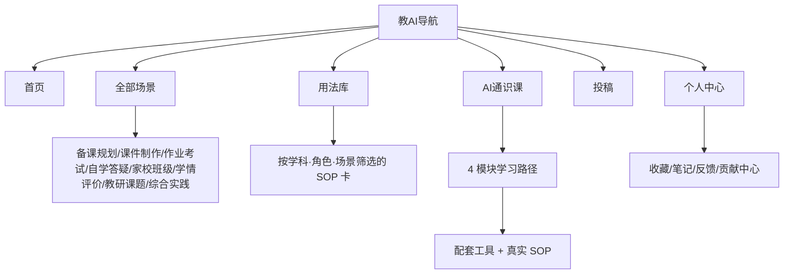

# 教AI导航 · UI 设计需求文档（K12 版）

> 基于 `ai-navigation-pro/` 内已有原型（首页 / 全部场景 / 工具详情 / 用法库 / AI通识课 / 个人中心 / 登录 / 投稿），输出可落地的 UI 设计需求。
> 设计目标：**符合 K12 老师/学生/家长审美，界面简洁大方、易用，且 Web 与移动 H5 双端自适应**。

---

## 1. 项目背景与设计目标

**背景**：已有原型验证了"教育垂类 AI 工具导航 + 使用路径 SOP"的差异化价值。现需把原型升级为高保真、可交付的设计图，统一视觉语言并补齐响应式规范，便于后续交给开发或直接出图。

**设计目标**
- **体验**：降低老师/家长/学生的认知负荷，三步内找到工具、看懂用法。
- **业务**：突出"SOP/用法库"与"AI通识课"两个差异化内容资产，提升收藏/笔记/投稿等留存动作。
- **品牌**：友好、可信、不幼稚也不冰冷；传递"AI 助教"的专业温度。

**核心设计挑战**
1. 四类角色（老师/学生/家长/管理员）共用一套界面，需用"角色色 + 角色筛选"而非分端，控制复杂度。
2. 工具发现（全部场景）与学习方法（用法库 / 通识课）易混淆，需用**信息类型 + 主筛选轴**解耦（已在原型中验证）。
3. K12 受众对可读性、触控尺寸、对比度敏感，需满足 WCAG AA。

---

## 2. 用户角色与场景

| 角色 | 典型目标 | 高频场景 | 视觉角色色 |
|---|---|---|---|
| 老师 | 减负、提质、出好课 | 备课规划 / 课件制作 / 作业考试 / 学情评价 / 家校班级 | 靛紫 `#6366f1` |
| 学生 | 搞懂、练会、不抄答案 | 自学答疑 / 综合实践 / 英语答疑 | 青绿 `#0ea5a4` |
| 家长 | 看懂、协同、监督 | 学情评价 / 家校班级 | 玫红 `#ec4899` |
| 学校管理员 | 治理、统管、培训 | 教研课题 / 校方内训版（P2） | 紫 `#8b5cf6` |

---

## 3. 信息架构

### 3.1 整体 IA（Mermaid）



### 3.2 页面层级

```
L1 首页 / 全部场景 / 用法库 / AI通识课 / 投稿 / 个人中心 / 登录
L2 场景二级页（8 个教学场景，多维筛选工具列表）
L2 工具详情页（12 个工具：定位 + SOP 模块 + 合规 + 替代）
L2 用法库 SOP 卡（点击进入工具详情的 SOP 区）
```

---

## 4. 核心交互流程

**主流程（找工具→学用法→留存）**
`首页/全部场景 → 选场景(角色筛选) → 工具列表 → 工具详情(SOP) → 收藏 / 写笔记 / 提反馈`

**投稿流程**
`投稿页填写 → 提交(待审核) → 编辑审核 → 发布 / 驳回(通知)`

**登录流程**
`点击收藏/笔记/反馈(未登录) → 登录弹层(昵称+身份) → 回写状态`

**异常流程**
`无网络 → 读路径走缓存 SSG/ISR，写动作提示"稍后重试"；搜索无结果 → 空态引导投稿；审核驳回 → 站内信说明原因。`

---

## 5. 关键交互细节

- **角色筛选**：全部场景页顶部角色 tab，实时调暗非相关场景卡（`opacity:.25; pointer-events:none`），不打断浏览。
- **SOP 复制**：提示词块右上"复制"按钮，写入剪贴板 + Toast 反馈。
- **收藏/社交证明**：♡ 切换 + Toast；用法库 👍/📌 计数 +1 并高亮（`sp-btn.on`）。
- **状态转换**：登录态决定收藏/笔记/反馈是否可写；未登录引导登录。
- **动效规范**：卡片 hover `translateY(-2~3px)` + 阴影增强（`--sh`），150–180ms 缓动；移动端禁用悬浮动效，改用点击态。

---

## 6. 页面布局规范

| 页面 | 桌面布局 | 移动 H5 布局 |
|---|---|---|
| 首页 | Hero + 场景 3 列 + 通识课推广 + 工具 4 列 | 单列；场景/工具 2 列；顶部导航折叠，底部 Tab 导航 |
| 全部场景 | 角色 tab + 8 个场景卡(3 列) | 角色 tab 横滑；场景卡单列 |
| 工具详情 | 左 SOP(1.6fr) + 右信息(1fr) 两栏 | 单列堆叠；SOP 优先 |
| 用法库 | 学科(主)+角色+场景筛选 + SOP 卡 3 列 | 筛选堆叠；SOP 卡单列 |
| AI通识课 | 模块竖向列表 + 相关工具 4 列 | 模块单列；工具 2 列 |
| 个人中心 | 头部 + 3 项数据卡 + Tab 面板 | 头部居中；数据卡单列 |

**通用组件布局**：顶栏 sticky（桌面/平板）；移动端隐藏顶栏链接与搜索，改用**底部 5 Tab 导航**（首页/场景/用法/通识/我的）。

---

## 7. 视觉风格定义

### 7.1 色彩体系（满足 WCAG AA 对比度）
| 用途 | 色值 | 说明 |
|---|---|---|
| 主色 Primary | `#6366f1` | 信任感靛紫；文字对比 ≥4.5:1 |
| 主色深 | `#4338ca` | 标题/激活态 |
| 主色浅 | `#eceefe` | 标签/选中底 |
| 暖橙 Accent | `#ff8a4c` | CTA 辅助/热门 |
| 青绿 Teal | `#0ea5a4` | 学生/成功 |
| 玫红 Pink | `#ec4899` | 家长 |
| 紫 Violet | `#8b5cf6` | 管理员 |
| 文本 | `#1f2533` / 次级 `#3c4456` / 弱化 `#6b7385` |
| 背景 | `#f5f7fd`；卡片 `#ffffff` |
| 边框 | `#e7eaf3` |

### 7.2 字体规范
- 字体族：PingFang SC / Microsoft YaHei / 系统默认；**基准 16px**。
- 字阶：12 / 13 / 14 / 15 / 16 / 17 / 19 / 21 / 24 / 28 / 32 / 40(px)。
- 字重：正文 400，标签/按钮 700，标题 800–850。
- 行高：正文 1.65；标题 1.25–1.3。

### 7.3 圆角 / 阴影 / 间距
- 圆角：小 `12px`、标准 `18px`、大 `24px`、胶囊 `999px`（友好亲和）。
- 阴影：`--sh-sm`（卡片静止）、`--sh`（hover）、`--sh-lg`（弹窗/主 CTA）。
- 间距：4px 基准（4/8/12/16/20/24/32/40/48/64）。

### 7.4 图标 / 插画
- 功能图标用 emoji + 几何色块（低成本、跨端一致）；品牌 Logo 用渐变方块「教」。
- 插画风格：扁平、圆角、低饱和暖色，避免写实照片（保护未成年肖像、降低素材授权风险）。

---

## 8. 异常状态处理

| 类型 | 表现 | 处理 |
|---|---|---|
| 网络异常 | 列表加载失败 | 读路径用 SSG/ISR 缓存；写动作 Toast "网络异常，请重试" |
| 搜索无结果 | 空态 | 引导「投稿该工具」+ 推荐热门 SOP |
| 提交校验失败 | 字段红框 + 文案 | 聚焦首个错误字段 |
| 审核驳回 | 站内信 | 说明原因 + 可修改重投 |
| 未登录写操作 | 拦截 | 弹出登录层，完成后回写 |

---

## 9. 埋点需求

| 事件 | 触发时机 | 关键参数 |
|---|---|---|
| `tool_view` | 打开工具详情 | tool_slug, scene, role |
| `sop_copy` | 点击复制提示词 | tool_slug, step_index |
| `tool_fav` | 收藏/取消 | tool_slug, is_on |
| `sop_useful` / `sop_collect` | 用法库点赞/收藏 | sop_id, type |
| `search` | 提交搜索 | query, result_count |
| `role_filter` | 切换角色筛选 | role |
| `submit_tool` | 提交投稿 | has_sop(bool) |
| `login` | 完成登录 | role |
| `literacy_module_view` | 进入通识课模块 | module_index |

---

## 10. 设计交付清单

**设计稿（高保真 HTML 设计图，已产出）**
- `design/index.html` 首页
- `design/scenes.html` 全部场景
- `design/tool.html` 工具详情（含 SOP）
- `design/usages.html` 用法库
- `design/literacy.html` AI通识课
- `design/profile.html` 个人中心
- `design/login.html` 登录
- `design/submit.html` 投稿

**规范文档**
- `design/system.css` 设计系统（token + 组件 + 响应式）
- `ai-navigation-pro/设计需求文档.md`（本文）

**原型（功能验证用，既有）**
- `ai-navigation-pro/*.html` + `generate.js` + `assets/`

---

## 11. 设计风险评估

| 风险 | 应对 |
|---|---|
| K12 审美把握偏差（过幼稚/过商务） | 用"友好靛紫+暖橙+大圆角+可读字体"平衡；以老师端为先做可用性走查 |
| 移动 H5 信息密度过高 | 启用底部 Tab 导航、单列布局、收起筛选为堆叠 |
| 角色混淆导致误用 | 角色色 + 角色筛选贯穿全站；场景卡标注适用角色 |
| 合规/肖像风险 | 插画替代真人照片；合规提示常驻工具详情 |
| 设计图与开发还原偏差 | 提供 `system.css` 设计令牌，组件一一对应，减少主观还原 |

---
*设计：UI Designer · 2026-07-29*
